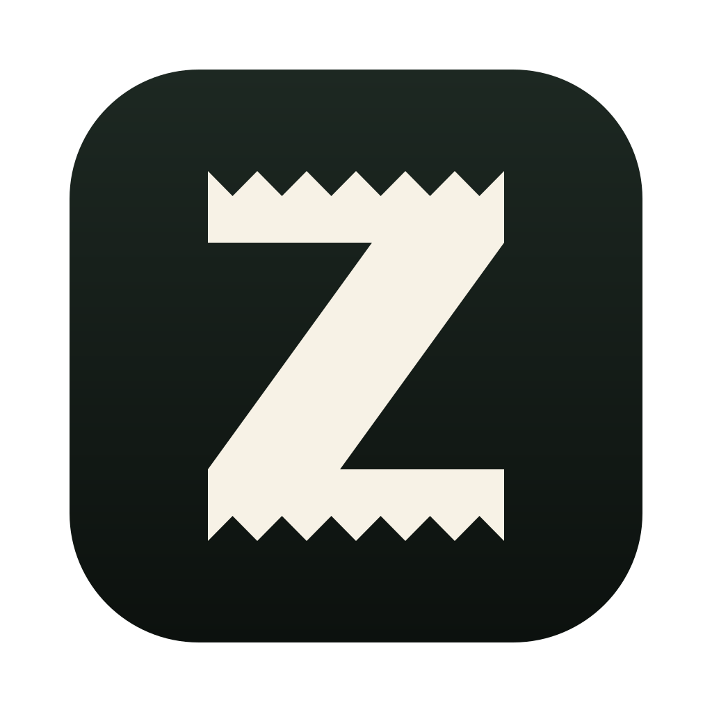

<p align="center">
  
</p>

<h1 align="center">Z Report</h1>

<p align="center"><em>Your Claude Code and Codex sessions, closed out every evening as a journal of what you actually got done.</em></p>

<p align="center">
  <a href="#install">Install</a> ·
  <a href="#how-a-day-goes">How it works</a> ·
  <a href="#what-stays-on-your-mac">Privacy</a> ·
  <a href="https://github.com/alikayhan/z-report-releases/releases/latest">Latest release</a> ·
  <a href="https://github.com/alikayhan/z-report-releases/issues">Report a problem</a>
</p>

---

You ship more than you remember. By Friday the Tuesday fix is a blur, and the
performance-review doc is a blank page. Z Report fixes that without asking you to log
anything: it reads the session transcripts Claude Code and Codex already keep on your Mac,
cross-checks them against your Git history, and hands you a short list of achievements
to approve, edit, or discard. Approved entries land in a private journal you can export
as Markdown for standups, weekly updates, or reviews.

The name comes from the Z-report a cash register prints at closing time: it totals what
was actually recorded and closes the books on the day.

## Install

```sh
brew install --cask alikayhan/tap/z-report
```

Then open **Z Report** from Applications. It runs as a normal desktop window and keeps a
menu-bar icon; closing the window leaves it collecting evidence in the background.

Prefer a download? Grab the DMG from the
[latest release](https://github.com/alikayhan/z-report-releases/releases/latest) and drag
Z Report to Applications. Every release is signed with a Developer ID, notarized by
Apple, and checksummed (`checksums.txt` on the release page), so there is no Gatekeeper
warning to click through.

**You need:**

- An Apple Silicon Mac on macOS 13 or newer.
- The [Claude Code CLI](https://claude.com/product/claude-code) or the
  [Codex CLI](https://github.com/openai/codex), installed and signed in. Any install
  works, including `brew install --cask claude-code` or `brew install --cask codex`.
  Evaluations run on your own account: Claude Code when it is present, Codex otherwise.

## Claude Code mod

Z Report also runs inside Claude Code. `/z-report` opens the same review queue and
journal in a pane, so you can approve cards without leaving the terminal. It uses an
early-access Claude Code feature and needs:

- Claude Code 2.1.273 or newer
- `CLAUDE_CODE_ENABLE_FUNCTION_HOOKS=1` in your environment, for example under `env`
  in `~/.claude/settings.json`
- if you use the desktop app, Z Report 0.2.3 or newer, opened once

```sh
claude plugin marketplace add alikayhan/z-report-releases
claude plugin install z-report@z-report
```

Start a new Claude Code session and run `/z-report`. New versions arrive with
`claude plugin update z-report@z-report`. The mod and the desktop app share one journal.

## How a day goes

1. **Work as usual.** Every 30 minutes Z Report scans your local Claude Code and
   Codex transcripts and notes the facts: prompts, files changed, commands run and whether
   they passed, pull requests opened, connected tools used. Work delegated to
   sub-agents counts as yours.
2. **Z-read.** At a time you choose, a notification says something like
   "3 achievements are ready." Want it sooner? **Review now** runs a mid-day read on
   demand. A first run backfills about two weeks of work.
3. **Confirm.** Approve, edit, merge, or discard each card, by click or keyboard
   (`J`/`K` to move, `A` approve, `E` edit, `X` discard). Cards that look like two halves
   of the same task say so, with merge one click away. Nothing enters the journal
   without you.
4. **Export.** Copy or save a daily, weekly, or custom-range Markdown summary.

## Claims you can stand behind

Every achievement carries a label that says how much local evidence backs it, and the
label is set by deterministic checks, not by the model:

| Label | What it means |
| --- | --- |
| **Work observed** | The session shows investigation or implementation |
| **Change produced** | A concrete change exists, in the repo or outside it |
| **Locally verified** | A relevant test, build, or check passed |
| **Committed** | The change is in a local commit, or a pull request was recorded |
| **Impact confirmed** | You personally confirmed a real-world outcome |

Commits are checked with Git, commands against their recorded exit status, files against
the session's change list. If the evaluator overstates something, the verifier downgrades
it and says so. That is what makes the export safe to paste into a review.

## What stays on your Mac

Everything, with two exceptions that you are told about up front.

- All data (evidence, candidates, journal, settings) lives in
  `~/Library/Application Support/com.alikayhan.zreport/` as SQLite. No accounts, no
  sync, no backend, no analytics, no telemetry.
- **Exception 1, evaluation.** Each Z-read runs on your own Claude Code account, or on
  your Codex account when Claude Code is not installed or its run fails, and sends the
  prepared evidence package (session excerpts, file paths, command results, names of
  connected tools used, commit and pull request metadata) to Anthropic, or to OpenAI for
  a Codex run. It is the same boundary as using that tool itself. Arguments passed to
  connected tools are never included; only the server and tool name. Prompt excerpts can
  be turned off in Settings → Privacy.
- **Exception 2, update check.** About once a day the app asks GitHub for the latest
  release metadata. The request carries nothing about you or your work.

The evaluator itself is sandboxed: an ephemeral run with a read-only tool allowlist, a
working directory containing only the evidence package, and no access to your settings
or previous sessions. Full transcripts are never copied, only referenced. **Delete all
data** in Settings erases everything.

## Updates

Z Report tells you when a new version is out: a notification, and a download button
beside the version at the bottom of the sidebar. It installs only when you click that
button, never while an evaluation is running, and restarts into the new version when
you're ready. "Check for Updates…" lives in the menu bar menu. If you would rather drive
it from the terminal:

```sh
brew upgrade --cask z-report
```

## Uninstall

```sh
brew uninstall --cask z-report        # keeps your journal and settings
brew uninstall --zap --cask z-report  # also removes all data
```

Without Homebrew: quit Z Report from the menu bar, delete it from Applications, and
remove `~/Library/Application Support/com.alikayhan.zreport` if you also want the data
gone.

## About this repository

Z Report is open source at [alikayhan/z-report](https://github.com/alikayhan/z-report).
This repository publishes the signed release binaries, the updater metadata the installed
app checks, the Claude Code plugin marketplace, and the Homebrew Cask's home page. Each
release is built from a version tag and lists the source commit it came from. Found a bug
or have an idea? [Open an issue](https://github.com/alikayhan/z-report-releases/issues).
